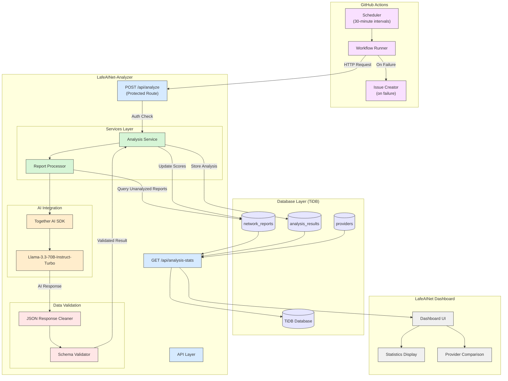
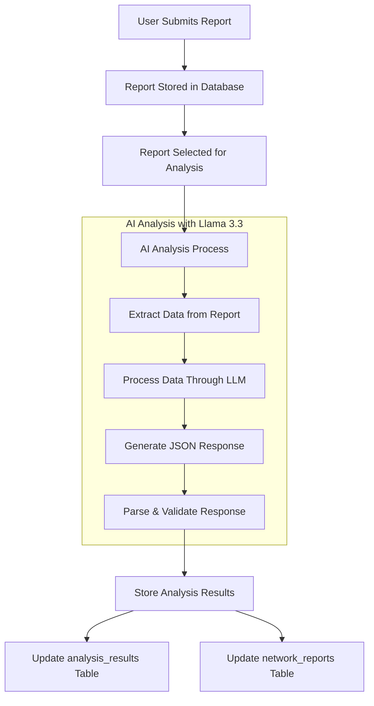

# LafeAINet-Analyzer

<div align="center">
  
  
  
  
  
  
    
  <br>
  <strong>🔥 Submission for AI for Connectivity Hackathon II: Building Resilient Networks</strong>
</div>

<br>

<div align="center">
  <p><em>AI-powered network quality analysis for Timor-Leste</em></p>
  <p>Transforming user reports into actionable network insights</p>
</div>

## 🌍 About LafeAINet-Analyzer

LafeAINet-Analyzer is the AI processing engine that powers the LafeAINet ecosystem, applying advanced language models to analyze network quality reports collected from users in Timor-Leste. It processes user feedback, speed test results, and other network metrics to generate meaningful insights about telecommunications infrastructure quality and performance.

### 🚀 Key Features

- **AI-Powered Analysis**: Utilizes Llama 3.3 70B via Together AI to process network reports
- **Sentiment Analysis**: Evaluates user satisfaction across different network aspects
- **Quality Scoring**: Generates objective quality scores based on user reports and metrics
- **Provider Comparisons**: Enables data-driven comparisons between network providers
- **Automated Processing**: Scheduled analysis using GitHub Actions
- **Secure API Design**: Protected endpoints with token-based authentication
- **Comprehensive Statistics**: Detailed analytics on network performance trends

## 🛠️ Technology Stack

- **Frontend**:
  - Next.js 15
  - React 19
  - TypeScript
- **Backend**:
  - Next.js API Routes
  - Together AI SDK
  - MySQL2 client
- **Database**:
  - TiDB (MySQL-compatible)
- **AI Model**:
  - Llama 3.3 70B Instruct Turbo via Together AI
- **Automation**:
  - GitHub Actions for scheduled processing

---

## 📊 System Architecture

LafeAINet-Analyzer follows a modular architecture focused on reliable AI processing:



## 🔍 Analysis Process

The analyzer processes reports through several stages:

1. **Data Collection**: Reports from LafeAINet-Report are stored in the database
2. **Scheduled Processing**: GitHub Actions triggers the analyzer every 30 minutes
3. **AI Analysis**: Each report is processed by the Llama 3.3 model, which evaluates:
   - Overall sentiment (-1 to 1 scale)
   - Network quality (0 to 10 scale)
   - Aspect-specific analysis (speed, reliability, value, service)
4. **Result Storage**: Analysis results are stored back in the database
5. **Dashboard Integration**: Results are displayed in LafeAINet-Dashboard

---

## 🔧 Installation and Setup

### Prerequisites

- Node.js 20 or higher
- npm or yarn
- MySQL-compatible database (TiDB recommended)
- Together AI API key

### Setup Instructions

1. Clone the repository:

   ```bash
   git clone https://github.com/ajitonelsonn/lafeainet-analyzer.git
   cd LafeAINet-Analyzer
   ```

2. Install dependencies:

   ```bash
   npm install
   # or
   yarn install
   ```

3. Create a `.env.local` file with your configuration:

   ```
   # Database
   DB_HOST=your-database-host
   DB_USER=your-database-user
   DB_PASSWORD=your-database-password
   DB_NAME=db_netrep_tls
   DB_PORT=4000

   # AI
   TOGETHER_API_KEY=your-together-ai-key

   # Security
   API_SECRET=your-api-secret-for-jobs
   ```

4. Run the development server:

   ```bash
   npm run dev
   # or
   yarn dev
   ```

5. Set up GitHub repository secrets for automated analysis:
   - Add all environment variables as repository secrets
   - Add `APP_URL` pointing to your deployed instance

---

## 🌱 The Bigger Picture

LafeAINet-Analyzer is part of LafeAINet, an initiative aimed at improving connectivity in Timor-Leste:

- **[LafeAINet](https://github.com/ajitonelsonn/LafeAINet)**: The main repository accumulating all three applications in the ecosystem
- **[LafeAINet-Report](https://github.com/ajitonelsonn/lafeainet-report)**: Collects user network experiences and metrics
- **[LafeAINet-Analyzer](https://github.com/ajitonelsonn/lafeainet-analyzer)**: Processes the data with AI (this repository)
- **[LafeAINet-Dashboard](https://github.com/ajitonelsonn/lafeainet-dashboard)**: Visualizes insights and provider comparisons

Together, these components create a comprehensive system for understanding and improving network infrastructure in underserved areas.

---

## Analysis Flow Diagram



## Example Analysis Process

Let's walk through the analysis of report ID 510001:

### 1. Original User Report Data

```
Report ID: 510001
Download Speed: 0.56 Mbps
Upload Speed: 0.96 Mbps
Comment: "It's Verry Good"
```

### 2. AI Processing Steps

#### Step 1: Create Prompt for LLM

The system constructs a prompt that includes:

- System instructions on how to analyze network reports
- The report data including comment and speed metrics
- Required output format specification

#### Step 2: Submit to Llama 3.3 70B Model

The prompt is sent to the Together AI platform which processes it using the Llama 3.3 model.

#### Step 3: AI Generates Response

The model analyzes the comment against the speed data and generates a structured response:

```json
{
  "sentiment_score": 0.8,
  "quality_score": 2,
  "analysis": "The user is generally satisfied with the network, but the speeds are very low.",
  "sentiment_aspects": {
    "speed_satisfaction": -0.8,
    "reliability_satisfaction": 0.5,
    "service_satisfaction": 0.5,
    "value_satisfaction": 0.2,
    "aspects_analysis": "The user is dissatisfied with the speed, but the reliability and service are somewhat satisfactory, and the value is neutral."
  }
}
```

#### Step 4: Response Cleaning & Validation

- Remove any markdown formatting (`json`)
- Parse the JSON string into a JavaScript object
- Validate that all required fields are present and of correct types

### 3. AI Analysis Interpretation

| Metric                   | Value | Scale   | Interpretation                                                     |
| ------------------------ | ----- | ------- | ------------------------------------------------------------------ |
| sentiment_score          | 0.8   | -1 to 1 | High positive sentiment despite technical issues                   |
| quality_score            | 2     | 0 to 10 | Very low quality rating based on objective metrics                 |
| speed_satisfaction       | -0.8  | -1 to 1 | Strong dissatisfaction with speed (aligned with actual low values) |
| reliability_satisfaction | 0.5   | -1 to 1 | Moderate satisfaction with reliability                             |
| service_satisfaction     | 0.5   | -1 to 1 | Moderate satisfaction with service                                 |
| value_satisfaction       | 0.2   | -1 to 1 | Slightly positive value perception                                 |

### 4. Analysis Logic Explained

The AI detected a **contradiction** between:

- The positive comment ("It's Verry Good")
- The very low speed metrics (0.56 Mbps download, 0.96 Mbps upload)

This results in:

- High sentiment score (0.8) reflecting the positive comment
- Low quality score (2) reflecting the objective speed measurements
- Detailed aspect analysis that recognizes the user is positive overall but objectively should be dissatisfied with speed

### 5. Database Updates

#### Update to `analysis_results` table:

```sql
UPDATE analysis_results
SET sentiment_score = 0.8,
    quality_score = 2,
    sentiment_aspects = '{"speed_satisfaction":-0.8,"reliability_satisfaction":0.5,"service_satisfaction":0.5,"value_satisfaction":0.2,"aspects_analysis":"The user is dissatisfied with the speed, but the reliability and service are somewhat satisfactory, and the value is neutral."}',
    analysis_details = '{"analysis":"The user is generally satisfied with the network, but the speeds are very low.","quality_score":2,"sentiment_aspects":{"aspects_analysis":"The user is dissatisfied with the speed, but the reliability and service are somewhat satisfactory, and the value is neutral.","reliability_satisfaction":0.5,"service_satisfaction":0.5,"speed_satisfaction":-0.8,"value_satisfaction":0.2},"sentiment_score":0.8}',
    updated_at = NOW()
WHERE report_id = 510001
```

#### Update to `network_reports` table:

```sql
UPDATE network_reports
SET sentiment_score = 0.8,
    network_quality_score = 2,
    updated_at = NOW()
WHERE id = 510001
```

---

## 🔒 Privacy Considerations

LafeAINet-Analyzer is designed with privacy in mind:

- No personally identifiable information is processed
- All analysis is focused on network performance, not user behavior
- Reports can be submitted anonymously
- Analysis results are used solely for network improvement purposes

## 📜 License

This project is licensed under the [MIT License](LICENSE) - see the LICENSE file for details.

## 🙏 Acknowledgments

- This project is a submission for the [AI for Connectivity Hackathon II: Building Resilient Networks](https://lablab.ai/event/ai-for-connectivity-hackathon-building-resilient-networks)
- Thanks to all open-source projects that made this possible

---

<div align="center">
  <p>Built with 💙 for improving connectivity in Timor-Leste</p>
</div>
