# 🌏 LafeAINet-Analyzer

<div align="center">
  
  
  
  
  
  
  <br>
  <strong>🏆 Submission for AI for Connectivity Hackathon II: Building Resilient Networks</strong>
</div>

<div align="center">
  <h3>AI-powered network quality analysis for Timor-Leste</h3>
  <h4>Transforming user feedback into actionable network insights</h4>
  <p><a href="https://lafeainet-analyzer.onrender.com">View Live Demo →</a></p>
</div>


## 🌍 About LafeAINet-Analyzer

LafeAINet-Analyzer serves as the AI processing engine for the LafeAINet ecosystem, leveraging advanced language models to analyze network quality reports collected from users across Timor-Leste. The system processes user feedback, speed test results, and other network metrics to generate meaningful insights about telecommunications infrastructure quality and performance.

### 🚀 Key Features

- **AI-Powered Analysis**: Leverages Llama 3.3 70B via Together AI to process network reports
- **Multi-Dimensional Analysis**: Evaluates sentiment, quality, and specific aspects of network performance
- **Provider Comparisons**: Enables data-driven comparisons between network providers
- **Automated Processing**: Uses GitHub Actions for scheduled analysis every 30 minutes
- **Secure API Design**: Implements token-based authentication for protected endpoints
- **Real-Time Dashboard**: Provides a comprehensive view of network performance trends

## 🔍 How It Works


### Analysis Process

1. **Data Collection**: Reports from users are stored in the database
2. **Scheduled Processing**: GitHub Actions triggers the analyzer every 30 minutes
3. **AI Analysis**: Each report is processed by the Llama 3.3 model, which evaluates:
   - Overall sentiment (-1 to 1 scale)
   - Network quality (0 to 10 scale)
   - Aspect-specific satisfaction (speed, reliability, value, service)
4. **Result Storage**: Analysis results are stored in the database
5. **Visualization**: Insights are displayed in the LafeAINet Dashboard

## 📊 System Architecture

```mermaid
flowchart TD
    subgraph "GitHub Actions"
        GHScheduler["Scheduler\n(30-minute intervals)"]
        GHWorkflow["Workflow Runner"]
        GHIssues["Issue Creator\n(on failure)"]
    end

    subgraph "LafeAINet-Analyzer"
        APILayer["API Layer"]
        AnalyzeEndpoint["POST /api/analyze\n(Protected Route)"]
        StatsEndpoint["GET /api/analysis-stats"]

        subgraph "Services Layer"
            AnalysisService["Analysis Service"]
            ReportProcessor["Report Processor"]
        end

        subgraph "AI Integration"
            TogetherAI["Together AI SDK"]
            LlamaModel["Llama-3.3-70B-Instruct-Turbo"]
        end

        subgraph "Data Validation"
            ResponseCleaner["JSON Response Cleaner"]
            SchemaValidator["Schema Validator"]
        end
    end

    subgraph "Database Layer (TiDB)"
        DB[(TiDB Database)]
        ReportsTable[("network_reports")]
        AnalysisTable[("analysis_results")]
        ProvidersTable[("providers")]
    end

    subgraph "LafeAINet Dashboard"
        Dashboard["Dashboard UI"]
        StatsDisplay["Statistics Display"]
        ProviderComparison["Provider Comparison"]
    end

    %% Connections - GitHub Actions flow
    GHScheduler --> GHWorkflow
    GHWorkflow -- "HTTP Request" --> AnalyzeEndpoint
    GHWorkflow -- "On Failure" --> GHIssues

    %% Connections - API flow
    AnalyzeEndpoint -- "Auth Check" --> AnalysisService
    StatsEndpoint --> DB

    %% Connections - Analysis flow
    AnalysisService --> ReportProcessor
    ReportProcessor -- "Query Unanalyzed Reports" --> ReportsTable
    ReportProcessor --> TogetherAI
    TogetherAI --> LlamaModel
    LlamaModel -- "AI Response" --> ResponseCleaner
    ResponseCleaner --> SchemaValidator
    SchemaValidator -- "Validated Result" --> AnalysisService

    %% Connections - Database writes
    AnalysisService -- "Store Analysis" --> AnalysisTable
    AnalysisService -- "Update Scores" --> ReportsTable

    %% Connections - Dashboard
    StatsEndpoint --> Dashboard
    Dashboard --> StatsDisplay
    Dashboard --> ProviderComparison
    ReportsTable --> StatsEndpoint
    AnalysisTable --> StatsEndpoint
    ProvidersTable --> StatsEndpoint

    %% Styling
    classDef github fill:#f9e0ff,stroke:#333,stroke-width:1px
    classDef apiLayer fill:#d6eaff,stroke:#333,stroke-width:1px
    classDef services fill:#d6f5d6,stroke:#333,stroke-width:1px
    classDef ai fill:#ffedcc,stroke:#333,stroke-width:1px
    classDef validation fill:#ffe6e6,stroke:#333,stroke-width:1px
    classDef database fill:#e6e6ff,stroke:#333,stroke-width:1px
    classDef dashboard fill:#f0f0f0,stroke:#333,stroke-width:1px

    class GHScheduler,GHWorkflow,GHIssues github
    class APILayer,AnalyzeEndpoint,StatsEndpoint apiLayer
    class AnalysisService,ReportProcessor services
    class TogetherAI,LlamaModel ai
    class ResponseCleaner,SchemaValidator validation
    class DB,ReportsTable,AnalysisTable,ProvidersTable database
    class Dashboard,StatsDisplay,ProviderComparison dashboard
```



## 🛠️ Technology Stack

<table align="center">
  <tr>
    <td align="center"><strong>Frontend</strong></td>
    <td align="center"><strong>Backend</strong></td>
    <td align="center"><strong>AI & Data</strong></td>
    <td align="center"><strong>Infrastructure</strong></td>
  </tr>
  <tr>
    <td>
      • Next.js 15<br>
      • React 19<br>
      • TypeScript<br>
      • TailwindCSS<br>
    </td>
    <td>
      • Next.js API Routes<br>
      • NextAuth.js<br>
      • MySQL2 client<br>
    </td>
    <td>
      • Llama 3.3 70B<br>
      • Together AI SDK<br>
      • TiDB database<br>
    </td>
    <td>
      • Render<br>
      • GitHub Actions<br>
    </td>
  </tr>
</table>

## 💡 Real-World Impact

LafeAINet-Analyzer helps solve critical connectivity challenges in Timor-Leste:

- **Evidence-Based Advocacy**: Provides data for informed policy discussions
- **Provider Accountability**: Creates transparency in network performance
- **Infrastructure Planning**: Identifies priority areas for network improvements
- **Public Awareness**: Empowers consumers with reliable information

## 🔧 Installation and Setup

### Prerequisites

- Node.js 20 or higher
- npm or yarn
- MySQL-compatible database
- Together AI API key

### Quick Start

1. **Clone the repository**

```bash
git clone https://github.com/ajitonelsonn/lafeainet-analyzer.git
cd lafeainet-analyzer
```

2. **Install dependencies**

```bash
npm install
# or
yarn install
```

3. **Configure environment variables**

Create a `.env.local` file with:

```
# Database
DB_HOST=your-database-host
DB_USER=your-database-user
DB_PASSWORD=your-database-password
DB_NAME=db_netrep_tls
DB_PORT=4000

# AI
TOGETHER_API_KEY=your-together-ai-key

# Security
API_SECRET=your-api-secret-for-jobs

# Auth
NEXTAUTH_URL=http://localhost:3000
NEXTAUTH_SECRET=your-nextauth-secret
```

4. **Run the development server**

```bash
npm run dev
# or
yarn dev
```

5. **Set up GitHub Actions**

Add repository secrets for CI/CD:

- `DB_HOST`, `DB_USER`, `DB_PASSWORD`, `DB_NAME`, `DB_PORT`
- `TOGETHER_API_KEY`
- `API_SECRET`
- `APP_URL` (your deployed instance URL)

## Example Analysis Process

Let's walk through the analysis of report ID 510001:

### 1. Original User Report Data

```
Report ID: 510001
Download Speed: 0.56 Mbps
Upload Speed: 0.96 Mbps
Comment: "It's Verry Good"
```

### 2. AI Processing Steps

#### Step 1: Create Prompt for LLM

The system constructs a prompt that includes:

- System instructions on how to analyze network reports
- The report data including comment and speed metrics
- Required output format specification

#### Step 2: Submit to Llama 3.3 70B Model

The prompt is sent to the Together AI platform which processes it using the Llama 3.3 model.

#### Step 3: AI Generates Response

The model analyzes the comment against the speed data and generates a structured response:

```json
{
  "sentiment_score": 0.8,
  "quality_score": 2,
  "analysis": "The user is generally satisfied with the network, but the speeds are very low.",
  "sentiment_aspects": {
    "speed_satisfaction": -0.8,
    "reliability_satisfaction": 0.5,
    "service_satisfaction": 0.5,
    "value_satisfaction": 0.2,
    "aspects_analysis": "The user is dissatisfied with the speed, but the reliability and service are somewhat satisfactory, and the value is neutral."
  }
}
```

#### Step 4: Response Cleaning & Validation

- Remove any markdown formatting (`json`)
- Parse the JSON string into a JavaScript object
- Validate that all required fields are present and of correct types

### 3. AI Analysis Interpretation

| Metric                   | Value | Scale   | Interpretation                                                     |
| ------------------------ | ----- | ------- | ------------------------------------------------------------------ |
| sentiment_score          | 0.8   | -1 to 1 | High positive sentiment despite technical issues                   |
| quality_score            | 2     | 0 to 10 | Very low quality rating based on objective metrics                 |
| speed_satisfaction       | -0.8  | -1 to 1 | Strong dissatisfaction with speed (aligned with actual low values) |
| reliability_satisfaction | 0.5   | -1 to 1 | Moderate satisfaction with reliability                             |
| service_satisfaction     | 0.5   | -1 to 1 | Moderate satisfaction with service                                 |
| value_satisfaction       | 0.2   | -1 to 1 | Slightly positive value perception                                 |

### 4. Analysis Logic Explained

The AI detected a **contradiction** between:

- The positive comment ("It's Verry Good")
- The very low speed metrics (0.56 Mbps download, 0.96 Mbps upload)

This results in:

- High sentiment score (0.8) reflecting the positive comment
- Low quality score (2) reflecting the objective speed measurements
- Detailed aspect analysis that recognizes the user is positive overall but objectively should be dissatisfied with speed

### 5. Database Updates

#### Update to `analysis_results` table:

```sql
UPDATE analysis_results
SET sentiment_score = 0.8,
    quality_score = 2,
    sentiment_aspects = '{"speed_satisfaction":-0.8,"reliability_satisfaction":0.5,"service_satisfaction":0.5,"value_satisfaction":0.2,"aspects_analysis":"The user is dissatisfied with the speed, but the reliability and service are somewhat satisfactory, and the value is neutral."}',
    analysis_details = '{"analysis":"The user is generally satisfied with the network, but the speeds are very low.","quality_score":2,"sentiment_aspects":{"aspects_analysis":"The user is dissatisfied with the speed, but the reliability and service are somewhat satisfactory, and the value is neutral.","reliability_satisfaction":0.5,"service_satisfaction":0.5,"speed_satisfaction":-0.8,"value_satisfaction":0.2},"sentiment_score":0.8}',
    updated_at = NOW()
WHERE report_id = 510001
```

#### Update to `network_reports` table:

```sql
UPDATE network_reports
SET sentiment_score = 0.8,
    network_quality_score = 2,
    updated_at = NOW()
WHERE id = 510001
```

## 🌱 The LafeAINet Ecosystem


LafeAINet-Analyzer is part of a larger initiative to improve connectivity in Timor-Leste:

- **[LafeAINet](https://github.com/ajitonelsonn/LafeAINet)**: Main repository for the complete ecosystem
- **[LafeAINet-Report](https://github.com/ajitonelsonn/lafeainet-report)**: User-facing app for collecting network reports
- **[LafeAINet-Analyzer](https://github.com/ajitonelsonn/lafeainet-analyzer)**: AI engine for processing network data (this repo)
- **[LafeAINet-Dashboard](https://github.com/ajitonelsonn/lafeainet-dashboard)**: Visualization platform for network insights

## 🔒 Privacy & Security

LafeAINet-Analyzer prioritizes privacy and security:

- No personally identifiable information processed
- Anonymous report submission supported
- API endpoints protected with token-based authentication
- Role-based access control for dashboard features
- Data used exclusively for network improvement

## 👥 Contributors

<table>
  <tr>
    <td align="center">
      <a href="https://github.com/ajitonelsonn">
        
        <br />
        <sub><b>Ajito Nelson</b></sub>
      </a>
    </td>
  </tr>
</table>

## 📜 License

This project is licensed under the [MIT License](LICENSE).

---

<div align="center">
  <p>Built with 💙 for improving connectivity in Timor-Leste</p>
  <p>
    <a href="https://lablab.ai/event/ai-for-connectivity-hackathon-building-resilient-networks">AI for Connectivity Hackathon II</a>
    •
    <a href="https://github.com/ajitonelsonn/LafeAINet">LafeAINet Ecosystem</a>
    •
    <a href="https://lafeainet-analyzer.onrender.com">Live Demo</a>
  </p>
</div>
